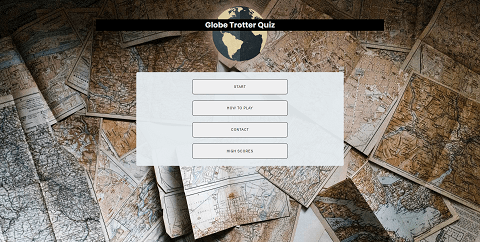
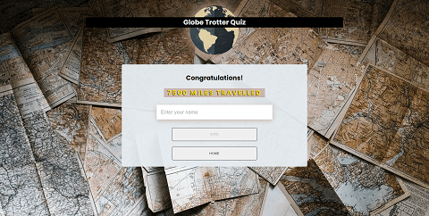
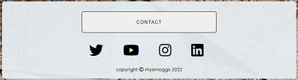
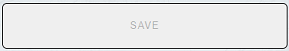
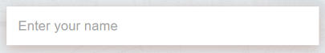
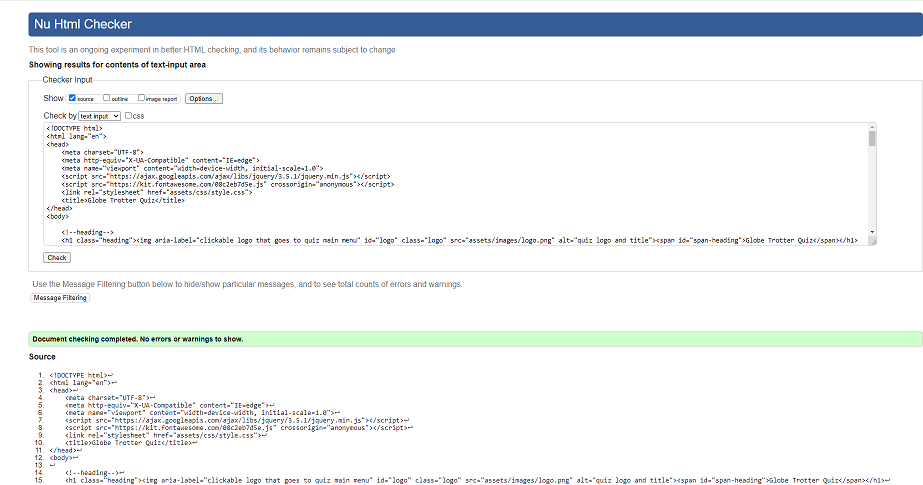
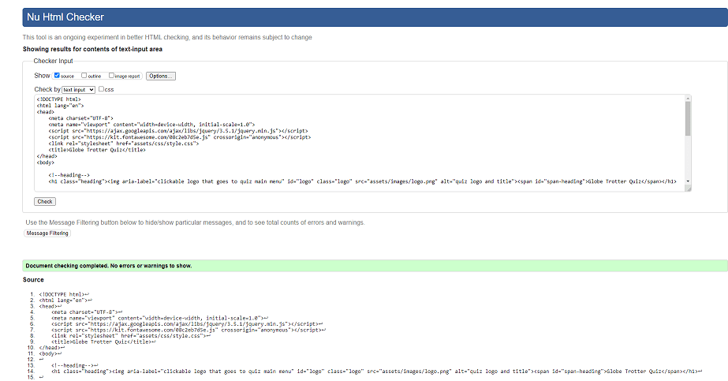
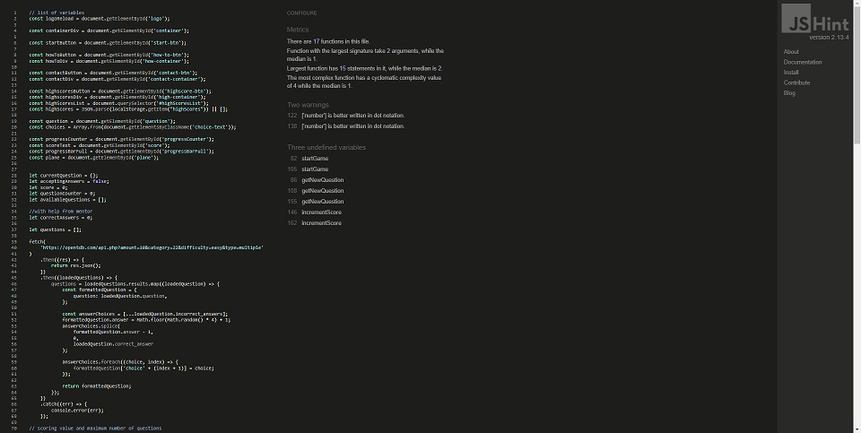

<h1 align="center">MS2 Quiz</h1>

[View the live project here.](https://rhysmoggs.github.io/ms2-quiz/)

Here is the brand new launch for the geography quiz: Globe Trotter Quiz.

This is the first interactive quiz the company has launched, announcing themselves to the world. Globe Trotter Quiz is a passion project, birthed from the creators love of travel and adventure. Having been fortunate enough to travel the world, the creator still longs and obsesses over memories and places visited, and loves to to be reminded about all travel-related things. The creator has a desire to share that love with a greater audience: like-minded people and travellers, keen quizzers, families and students - all are welcome to challenge themselves! The creator is excited to launch their quiz and hope to attract more and more players from across the world.

### Quiz premis and rules:

A classic geography quiz, suitable to single or multiple players of all ages. The Globe Trotter Quiz is a multiple-choice quiz where the user is presented with 10 questions, each correct answer worth 2500 miles. The goal? To answer 10 correct answers totalling a whopping 25,000 miles - about the same distance it is tofly around the globe! See if you can travel to the top of the High Scores list!

The quiz will clearly display information for new and returning customers including the creators contact information via social media links. The quiz is fully responsible on a range of devices - from hand-held devices to larger screens such as monitors or even TVs. This is to ensure that as many people as possible can play the quiz and enjoy this journey.

The quiz can be played by one person or as many as would like to partake. There are rumours of a more child-friendly version to follow with additions of sound and pictures and even theme changes.

The quiz generates 1 question at a time, with 4 multiple choice options as answers.
The player clicks on the buttons/answers and the quiz gives a visual prompt via the colour change to signify the players selection is correct (green) or incorrect (red).
The quiz automatically displays the next question after a short delay.
There are a total of 10 questions to answer.
The end screen for the quiz gives the total amount of 'miles travelled'.
A player can enter their name to save their high score to the High Scores list.

<h2 align="center"></h2>

## User Stories

Following are the goals that the quiz should provide for each user.

#### As a New User :
* I want to to be able to access and play quiz on the device I'm using.
* I want to to be able to play with ease.
* I want to to be able to understand the quiz immediately.
* I want to to be able to access instructions if need be.
* I want to to be able to contact the quiz developers if I wish to.
* I want there to be plenty of variety.

#### As a Returning User :
* I want to find information about the company's background, their story and growth.
* I want to find the best way to get in contact with the company with any questions I may have.
* I want to be able to contact the company in many different ways.
* I want to be able to view my high scores.
* I want to be able to save my score after the quiz.
* I want to to be able to access and play the quiz on a range of devices/browsers.

## Design
Once the user goals and the projects intentions were set out, the next step was to design the aesthetic aspects of the Globe Trotter quiz.

### Wireframes
Wireframes were drawn using [Balsamiq](https://balsamiq.com/) at the beginning of the project. They were referenced throughout the design and building of the quiz. Following are a series of images showing the Globe Trotter Quiz on the three main screen sizes: desktop, tablet and mobile. Every major section of the quiz is also included.

#### Desktop

- Home Page Wireframe


- Quiz Wireframe


- How To Play Wireframe


- Contact Wireframe


- High Scores Wireframe


- End Screen Wireframe


#### Tablet

- Home Page Wireframe


- Quiz Wireframe


- How To Play Wireframe


- Contact Wireframe


- High Scores Wireframe


- End Screen Wireframe


#### Mobile

- Home Page Wireframe


- Quiz Wireframe


- How To Play Wireframe


- Contact Wireframe


- High Scores Wireframe


- End Screen Wireframe


#### Colour Palette
- The colour palette has an old-fashioned, nostalgic theme which pays homage to classic travel and adventure when combined with the imagery. This contrasted well with a modern and functional quiz in terms of layout, and the general theme of travelling around the world by plane. The background image (maps.jpg) provides an array of browns, yellows, black and some shaded/darker colours.
- The heading and the game container use the same colour (rgba(230,236,240)), with a slight opacity for the container, allowing the background image to be seen, but not interfere too much with the flow and visibility of the quiz/content.
- By default, all buttons have a colour of "cultured/ whitesmoke" (rgb(239, 239, 239)) and that simplicity allows other colours and content to shine.
- The text colour is mostly black (rgb(0,0,0)) to ensure a greater contrast between the buttons and container colours. 
- The most important text is a gold or "cyber yellow" (rgb(255,210,0)) colour. This colour is synonymous with victory, champions and has forever been a highly desirable and attractive colour. The reason for choosing this colour is obviously to entice the user to keep totalling up the golden numbers during the quiz, and also to challenge the users to reach the top of the High Scores list.
- A slightly opaque antique brass (rgb(187 148 133) is often for shadows, to help bring depth and highlight some interactive features such as buttons.


- It was decided early on in the design stage that the gold (cyber yellow) colour would be important for the quiz. Some of the other colours were chosen around having this colour in mind, especially to ensure the colour was a focal point - always drawing the user's eyes to it and never obstructed or poorly contrasted by other colours. Therefore, the black font colour and the container and button colours provided the perfect colours to balance this. These combinations helped highlight the importance of providing a visually appealing quiz but also with high contrast and readability a priority.

- Here is the [Contrast Checker](https://webaim.org/resources/contrastchecker/) tool used to support this:


#### Images
- The use of photography is vital in creating allure and desire, especially for an interactive quiz. Users are drawn by what they see. The maps.jpg background image is large and provides a fantastic colour to build an interface on. It also provided contrast and highlighted the actual game area from the background itself. 

- It's vital for the theme to be clear and obvious. The background image makes the quiz recognizable and memorable so people recall and return to it, which will draw more eyes to the quiz. This, along with the CSS styling and colour palette, helps build and clarify that the quiz is travel related. The following image was used.


- Plane

- Logo

#### Font
-  The Globe Trotter Quiz uses the Poppins font. It provides that clean, clear style without compromising on readability - a vital design feature for any quiz. This is available for free via [Google Fonts](https://fonts.google.com/) and imported via CSS. Sans Serif is used as a secondary option in case of failure to import  the font into the quiz correctly. Poppins is a clean font used frequently in designs, so it is both attractive and appropriate.

## Accessibility
Extremely important aspect.
-   Semantic design.
-   The use of alt to describe images and other content.
-   Aria-labelledby to link sections.
-   Colour and contrast considerations and testing.
-   Adding labels to forms.

## Features

-   Responsive on all device sizes - from 320px upwards to larger desktops reaching 1200px and more.

Here are the 3 mains sections of the quiz:

### - The main menu


### - The quiz area


### - The end screen



## Interactive Elements

-   Following is a list of all interactive elements of the Globe Trotter Quiz.

#### Quiz Logo

As shown on the images below, the quiz logo and title is very clear and bright. The centrepiece, always there and clickable. It shows off the quiz nicely, it's obviously related to geography and serves as a constant reminder to the user about where they are and what they are playing. The logo itself is a clickable link (a cursor appears when hovering over), and returns the user back to the home page at any time. 


#### Toggle Menu Elements

Listed are the main features of the main menu of the quiz. The user simply clicks to show or hide the buttons to display info or return back to the main menu.

#### - How to Play


#### - Contact

Each icon for the social media links turn gold when the user hovers over them to highlight the focused icon.




#### - High Scores


#### Buttons

#### - General Buttons

- Almost every button is styled to look the same. A clean and clear button to make for user readability and speed, paramount to elite quizzing.


- The colours simply invert when a cursor hovers over them. A simple visual indicator and keeping in line with the colour palette.


#### - High Scores Button

- The few exception to the rule is the High Scores button (and mention the disabled button). Due to the nature of this button and it's significance, it was decided to style this differently with a golden (#) hue/ . This is pure bragging rights and to entice the players to compete for the highest score. it will be big factor for returning players.


#### - Save Button
- The Save button is set as disabled as a default. Once the user inputs their name, the button returns to a normal state, just like the others.



#### - Correct Answer Button

- gold (rgb(255,210,0)) indicates a correct answer


#### - Incorrect Answer Button

- red(rgb(255,0,0)) indicates an incorrect answer


#### - Input

- The 'Enter your name' input field has a very basic style applied. IF the user chooses not to enter their name, then the Save button remains disabled and the user will not be able to save their score to the High Scores section.



#### - Progress Bar

- The progress bar indicates the progress made by the user via the golden colour-fill and plane image. Every correct answer adds 10% to the progress bar - with the user's aim to reach 100%, a total of 10/10 correct answers.


## Technologies Used

### Languages Used

-   [HTML5](https://en.wikipedia.org/wiki/HTML5)
-   [CSS3](https://en.wikipedia.org/wiki/Cascading_Style_Sheets)
-   [JavaScript](https://en.wikipedia.org/wiki/JavaScript)

### Frameworks, Libraries & Programs Used

1. [Google Fonts:](https://fonts.google.com/)
    - Google fonts is used to import the 'Poppins' font into the style.css file which is used on all fonts within the quiz.
1. [Font Awesome:](https://fontawesome.com/)
    - Font Awesome is used on all pages throughout the quiz to add icons for aesthetic and UX purposes.
1. [jQuery:](https://jquery.com/)
    - jQuery is used to simplify and manipulate some tasks instead of regular JS.
1. [Git](https://git-scm.com/)
    - Git is used for version control by utilizing the Gitpod terminal to commit to Git and Push to GitHub.
1. [GitHub:](https://github.com/)
    - GitHub is used to store the projects code after being pushed from Git.
1. [Balsamiq:](https://balsamiq.com/)
    - Balsamiq is used to create the [wireframes](#wireframes) during the design process.
1. [Eye Dropper](https://eyedropper.org/).
    - This colour picker tool was used to to pick and experiment with colours.
1. [Coolors](https://coolors.co/)
    - This tool was used to to setup the colour palette [here](#colour-palette).
1. [Canva:](https://www.canva.com/)
    - Canva is used to create the quiz logo and small plane image seen in the progress bar.
1. [TinyPNG:](https://tinypng.com/)
    - TinyPNG is used to optimize images used in the quiz and this README.
1. [Miscrosoft Paint:](https://support.microsoft.com/en-us/windows/get-microsoft-paint-a6b9578c-ed1c-5b09-0699-4ed8115f9aa9)
    - Microsoft Paint is used to crop and resize images and editing photos for the project.
1. [Snip & Sketch:](https://www.microsoft.com/en-gb/p/snip-sketch/9mz95kl8mr0l)
    - Snip & Sketch is used to screenshot the majority of images used for this README.
1. [WPS Office:](https://www.wps.com/)
    - WPS Office is used to create the table for the [Testing Quiz Flow and Functionality](#testing-quiz-flow-and-functionality) and README.md spell-checking.

## Testing

The W3C Markup Validator, W3C CSS Validator and JSHint tools were used to validate every page of the project to ensure there were no syntax errors in the project. If any were found during development, they were addressed.

-   [W3C Markup Validator](https://validator.w3.org/#validate_by_input)

index.html


end.html


-   [W3C CSS Validator](https://jigsaw.w3.org/css-validator/#validate_by_input)

style.css


-   The Warnings(1), also seen on the above screenshot, references the Google imported style sheet, and that it won't check that.


-   [JSHint](https://jshint.com/) 

index.js


end.js


## Testing Original User Stories

Following are the original [User Stories](#user-stories) set out in the early design stages of the project. They were individually tested to see if each goal was satisfied against the completed project.

#### As a New User :
* I want to to be able to access and play quiz on the device I'm using.
    - The quiz has been tested for ease of access and responsiveness on dozens of devices (handheld devices such as mobile phones and tablets, laptops, desktop computers and larger Samsung TVs) and is fully responsible from at least a minimum of 320px up to at least 1200px. See [here](#further-testing) for more testing related tasks.
* I want to to be able to play with ease.
    - Part of the biggest draw to quiz by nature is their simplicity and easy of use. The quiz is a click-and-play format and the interactive prompts and layout make it very clear to understand for any first-time user.
* I want to to be able to understand the quiz immediately.
    - The style and layout, along with the interactive features and prompts enable first-time users to understand the quiz, the theme and it's purpose.
* I want to to be able to access instructions if need be.
    - The How to Play [button](#how-to-play) is clear and obvious from the first screen the user is presented with. A minimal styling setup and only 4 buttons ensure that information is displayed clearly and to not overwhelm users. All instructions are found after clicking on this button.
* I want to to be able to contact the quiz developers if I wish to.
    - The Contact [button](#contact) is clear and obvious from the first screen the user is presented with. A minimal styling setup and only 4 buttons ensure that information is displayed clearly and to not overwhelm users. All contact information is found after clicking on this button.
* I want there to be plenty of variety.
    - Thanks to the API automatically generating questions from a deep database and also having the answers randomly ordered from the 4 possible choice-containers, the variety and quiz is never the same.

#### As a Returning User :
* I want to find information about the developer's background, their story and growth.
    - The Contact [button](#contact) provides links to all the developers social media [links](#contact) (twitter, YouTube, instagram and LinkedIn). The contact information can be found on those platforms. For example the developers contact information is on each profile of these social media websites, there are YouTube vlogs of the company's developing stage, snippets of inside-info on instagram and all proffessional history and access via LinkedIn.
* I want to find the best way to get in contact with the company with any questions I may have.
    - Once the Contact [button](#contact) is clicked., it provides links to all the developers social media links (twitter, YouTube, instagram and LinkedIn). The contact information can be found on those platforms and provides a quick and direct link to the users queries.
* I want to be able to contact the company in many different ways.
    - Once the Contact [button](#contact) is clicked, it gives access to 4 social media options the user can choose to contact the developer through.
* I want to be able to view my high scores.
    - Once the High Scores [button](#high-ccores) is clicked, it gives access to the high scores list, with a maximum of 5 user names and scores capable of being displayed.
* I want to be able to save my score after the quiz.
    - After completing all 10 questions, the quiz displays the [end screen](#the-end-screen) to the user. Here, the user can choose to enter their name in the prompted [input field](#input) and the previously disabled Save [button](#save-button) is made clickable. If clicked, the user name is saved to the High Scores list if it made the top 5 high scores.
* I want to to be able to access and play the quiz on a range of devices/browsers.
    - The quiz has been tested for ease of access and responsiveness on dozens of devices (handheld devices such as mobile phones and tablets, laptops, desktop computers and larger Samsung TVs) and is fully responsible from at least a minimum of 320px up to at least 1200px. it also works on multiple browsers as stated [here](#further-testing).

## Google Chrome Lighthouse / Efficiency Test ??

Following are the Google Chrome Lighthouse results for each page.

- Main menu and quiz area/ index.html


- End page / end.html


### Testing Quiz Flow and Functionality

All of the following tests were repeated multiple times to ensure a fair test. The same tests were then repeated multiple times on different browsers (Google Chrome, Mozilla Firefox, Microsoft Edge and Opera) and then finally the same tests were repeated again on multiple occasions and for different devices (mobile phones, tablets, laptops and larger screen sizes).

#### - Main Menu Test


#### - Quiz Area Test


#### - End Screen Test


### Further Testing

-   Testing was predominantly made using Google Chrome's own developer tools and 'Inspect Mode', although testing was done sporadically on alternative browsers with each major addition to the quiz e.g new content, style updates and responsive changes via media queries.
-   Console.log() function was used for JavaScript code development.
-   All interactive elements of the quiz were tested. Button functions, clicking, hiding/showing content, user input, links and general flow of quiz. Bugs were fixed as they arose.
-   Testing that the score updated correctly, incrementing on correct answers only and progressBar progression to reflect this. The same process was done for incorrect answers and various combinations of correct and incorrect answers and users input. The final score was also checked against the in-game score for accuracy and again when submitting to the High Scores area.
-   The quiz was tested on Google Chrome, Mozilla Firefox, Microsoft Edge and Opera browsers and ran efficiently and consistently on each one. The quiz looked and operated as intended.
-   The quiz was viewed on a variety of devices such as Desktop, Laptop, iPad & iPhoneX.
-   Feedback from friends and family, testing the quiz with no prior instruction or expectations. Adjustments were made if necessary to satisfy the [User Targets](#as-a-new-user).

### Bug Fixes
Bug fixes were predominantly completed in real-time as soon as any issues arose. This was to ensure the project would continue developing smoothly without serious, unmanageable bugs arising later that could drastically reduce development time or the layout and functioning of the quiz.

-   As seen from the style.css file, there is a lot of custom CSS. Media queries were used at different breakpoints - although time consuming, it was vital to invest time into this to ensure the quiz was functioning correctly on various displays to ensure a major [User Targets](#as-a-new-user) was met. Some JavaScript tweaks were also implemented to alter the class width at different stages of the quiz e.g. the main menu, quiz itself or the end.

-   The main containers (see style.css classes .game-area and .container ) would either overlap or completely hide the quiz title and logo. The Globe Trotter Quiz title and logo should be on display at all times no matter what section of the quiz the user was viewing, so obviously this bug was very undesirable. This was bug was fixed in a few ways:
    - media queries, as explained above.
    - through adding a margin-top to push the container down and clear from the title and logo.
    - custom JavaScript code to alter specific classes.

-   Added rel-"noopener" to external links opening in new tabs for security purposes.

### Known Bugs

-   The background image (maps.jpg) repeats slightly towards the very bottom of the Surface Pro 7 (912px x 1368px) device.

## Deployment

### GitHub Pages

The project was deployed to GitHub Pages using the following steps...

1. Log in to GitHub and locate the [GitHub Repository](https://github.com/)
2. At the top of the Repository (not top of page), locate the "Settings" Button on the menu.
    - Alternatively Click [Here](https://raw.githubusercontent.com/) for a GIF demonstrating the process starting from Step 2.
3. Scroll down the Settings page until you locate the "GitHub Pages" Section.
4. Under "Source", click the dropdown called "None" and select "Master Branch".
5. The page will automatically refresh.
6. Scroll back down through the page to locate the now published site [link](https://github.com) in the "GitHub Pages" section.

### Forking the GitHub Repository

By forking the GitHub Repository we make a copy of the original repository on our GitHub account to view and/or make changes without affecting the original repository by using the following steps...

1. Log in to GitHub and locate the [GitHub Repository](https://github.com/)
2. At the top of the Repository (not top of page) just above the "Settings" Button on the menu, locate the "Fork" Button.
3. You should now have a copy of the original repository in your GitHub account.

### Making a Local Clone

1. Log in to GitHub and locate the [GitHub Repository](https://github.com/)
2. Under the repository name, click "Clone or download".
3. To clone the repository using HTTPS, under "Clone with HTTPS", copy the link.
4. Open Git Bash
5. Change the current working directory to the location where you want the cloned directory to be made.
6. Type `git clone`, and then paste the URL you copied in Step 3.

```
$ git clone https://github.com/YOUR-USERNAME/YOUR-REPOSITORY
```

7. Press Enter. Your local clone will be created.

```
$ git clone https://github.com/YOUR-USERNAME/YOUR-REPOSITORY
> Cloning into `CI-Clone`...
> remote: Counting objects: 10, done.
> remote: Compressing objects: 100% (8/8), done.
> remove: Total 10 (delta 1), reused 10 (delta 1)
> Unpacking objects: 100% (10/10), done.
```

Click [Here](https://help.github.com/en/github/creating-cloning-and-archiving-repositories/cloning-a-repository#cloning-a-repository-to-github-desktop) to retrieve pictures for some of the buttons and more detailed explanations of the above process.

## Credits

### Code
-   At the early stages of the development, the [How to Make a Quiz App using HTML CSS Javascript - Vanilla Javascript Project for Beginners Tutorial](https://www.youtube.com/watch?v=f4fB9Xg2JEY&list=FLoLMoJL7IfiYl8F3sN_CEqQ&index=16) tutorial was followed and the code was used as the basis of the quiz. Original code was later added alongside that found in the YouTube video to suit the quiz. Code tweaks were made to suit this quiz, pre-determined code edited or removed along with adjustments and restyling to the majority of the CSS found in the credited video. Upon further searching, it seems that [Build a Quiz App - Intro](https://www.youtube.com/watch?v=u98ROZjBWy8&list=PLDlWc9AfQBfZIkdVaOQXi1tizJeNJipEx) and that playlist of videos may be what the YouTube video I had followed to begin with was also inspired by.

-   The API aspect of the quiz was introduced thanks to the [Build a Quiz App (11) - Fetch API to Load Questions API](https://www.youtube.com/watch?v=3aKOQn2NPFs&list=PLDlWc9AfQBfZIkdVaOQXi1tizJeNJipEx&index=12) tutorial, to which edits were then made.

-   The ability to toggle (show and hide) content via the How To Play, Contact and High Scores buttons on the main menu screen came from W3Sschools documentation found [here](https://www.w3schools.com/howto/howto_js_toggle_hide_show.asp), and a separate source [here](https://sebhastian.com/javascript-show-hide-div-onclick-toggle/) which was then edited to suit the project, along with additional customization.

-   This README.md document was based on Code Institute's [SampleREADME](https://github.com/Code-Institute-Solutions/SampleREADME/blob/master/README.md). The template was used as a guide, then filled with content related to this quiz. The Bakes by Noemie [README.md](https://github.com/rhysmoggs/ms1-bakes-by-noemie/blob/main/README.md) file - the developers personal MS1 submission for the Code Institute course - was also used and then edited to suit this project.

### Inspiration

-   The Code Institute Slack community, especially projects from the peer-code-review channel.

### Content & Media

-   The questions and answers are all generated via an API from [The Open Trivia Database](https://opentdb.com/api_config.php).

-   The main background image (maps.jpg) - Photo by Andrew Neel from Pexels found [here](https://www.pexels.com/photo/assorted-map-pieces-2859169/).

-   The logo (logo.png) was created using Canva.

-   The plane (plane.png) image for the progress bar was created using Canva.

-   Unless mentioned in the [Code](#code) section, all other code is written by the developer.

### Acknowledgements

-   Stack Overflow [website](https://stackoverflow.com/) for general problem solving.

-   My Mentor for helpful feedback and input.

-   Tutor support at Code Institute.

-   codes whatever website for googling errors/help.


where to put future upgrades to game? difficulty level, pictures, music/sound effects, different themes, accessibility via colour change theme on/off